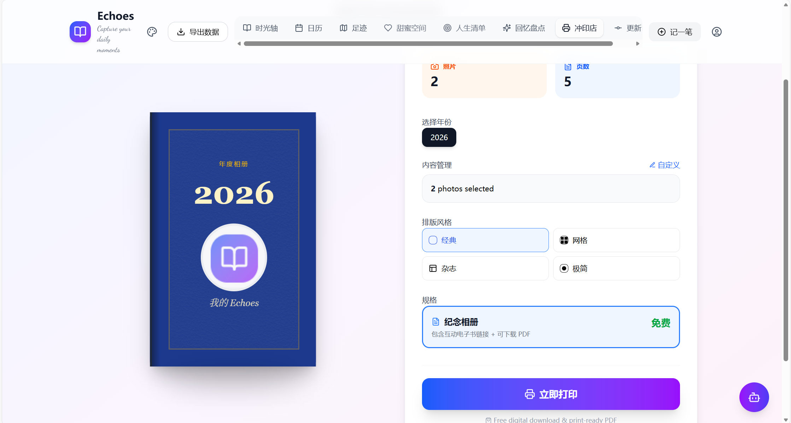

# Echoes 📸

> **Capture Your Life Moments, Intelligently.**  
> **用智能的方式，记录你的人生旅程。**

A private, beautiful, and intelligent space to document your life's journey, now available on Web, Android, and iOS.  
一个私密、精美且智能的生活记录空间，现已支持 Web、Android 和 iOS 全平台。


[](https://reactjs.org/)
[](https://www.typescriptlang.org/)
[](https://vitejs.dev/)
[](https://capacitorjs.com/)
[](https://supabase.com/)
[](LICENSE)

---

## 📸 Screenshots / 项目截图

<div align="center">
  
  
</div>
<div align="center">
  
  
</div>

---

<details>
<summary><strong>🇬🇧 English Introduction (Click to Expand)</strong></summary>

### ✨ About

**Echoes** is more than just a journal. It's a companion that helps you pause, capture, and cherish the fleeting moments of your life. Whether it's a perfect cup of coffee, a beautiful sunset, or a laugh shared with a friend, Echoes keeps these memories safe and vivid.

With powerful **AI Insights**, **Smart Tagging**, and a beautiful **Timeline**, your memories are not just stored—they are celebrated.

### 🚀 Key Features

- **📝 Rich Entries**: Record photos, moods, locations, and detailed stories.
- **📊 AI Insights**: Visualize your year in pixels, track mood trends, and discover "On This Day" memories.
- **👁️ Smart Vision**: Automatically recognize photo contents using on-device AI (TensorFlow.js).
- **🗺️ Interactive Map**: See your memories plotted on a global map with heatmaps and route playback.
- **💑 Couple Space**: Sync timelines with your partner in a shared, private space.
- **🏆 Life Milestones**: Gamify your life with achievements for fitness, reading, and photography.
- **🖨️ Print Shop**: Turn your digital memories into physical photo books and Polaroids.
- **📱 Cross-Platform**: Seamless experience on Web, Android, and iOS.
- **🔒 Private & Secure**: Your data is yours. Local-first architecture with optional cloud sync.

### 🛠️ Tech Stack

- **Frontend**: React, TypeScript, Tailwind CSS, Vite
- **Mobile**: Ionic Capacitor (Android & iOS)
- **UI Components**: Shadcn/ui, Lucide Icons, Framer Motion
- **AI/ML**: TensorFlow.js (MobileNet), Google Vision AI
- **Charts**: Recharts
- **Maps**: Leaflet / React-Leaflet
- **Backend**: Supabase (Edge Functions, Storage, Database)
- **Internationalization**: i18next (English, Chinese, Japanese, Korean)

</details>

---

<details open>
<summary><strong>🇨🇳 中文介绍 (点击收起)</strong></summary>

### ✨ 关于 Echoes

**Echoes** 不仅仅是一个日记本。它是你的生活伴侣，帮你驻足、定格并珍藏生命中那些稍纵即逝的美好瞬间。无论是一杯完美的咖啡、一场壮丽的日落，还是与好友的一次开怀大笑，Echoes 都能将这些记忆鲜活地保存下来。

通过强大的 **AI 智能回顾**、**智能标签**以及精美的**时光轴**，你的回忆不再是冰冷的数据，而是值得庆祝的生活足迹。

### 🚀 主要功能

- **📝 图文日记**：记录照片、心情、地点和详细的故事，支持富文本编辑。
- **📊 智能回顾**：通过“心情像素图”可视化你的一年，追踪情绪变化，重温“那年今日”。
- **👁️ 智能视觉**：利用端侧 AI (TensorFlow.js) 自动识别照片内容并打标签，无需上传云端。
- **🗺️ 足迹地图**：在世界地图上点亮你的足迹，支持热力图展示和旅行路线回放。
- **💑 甜蜜空间**：与伴侣共享私密空间，双人时光轴实时同步，记录共同回忆。
- **🏆 人生清单**：游戏化你的人生，解锁健身、阅读、摄影等领域的成就徽章。
- **🖨️ 冲印店**：将数字回忆一键生成实体照片书、拍立得或明信片（支持导出 PDF）。
- **📱 全平台支持**：Web、Android、iOS 无缝切换，随时随地记录。
- **🔒 私密安全**：数据完全属于你。采用“本地优先”架构，支持可选的云端同步。

### 🛠️ 技术栈

- **前端**: React, TypeScript, Tailwind CSS, Vite
- **移动端**: Ionic Capacitor (Android & iOS)
- **UI 组件**: Shadcn/ui, Lucide Icons, Framer Motion
- **AI/ML**: TensorFlow.js (MobileNet), Google Vision AI
- **图表**: Recharts
- **地图**: Leaflet / React-Leaflet (集成高德地图源)
- **后端**: Supabase (Edge Functions, Storage, Database)
- **国际化**: i18next (支持中、英、日、韩四语言)

</details>

---

## 🏃‍♂️ Getting Started / 快速开始

### Prerequisites / 前置要求

- Node.js (v18+)
- Android Studio (for Android build / 用于 Android 构建)
- Xcode (for iOS build, macOS only / 用于 iOS 构建)

### Installation / 安装步骤

1. **Clone the repository / 克隆仓库**
   ```bash
   git clone https://github.com/xuyanghou640-maker/Photo-Diary.git
   cd Photo-Diary
   ```

2. **Install dependencies / 安装依赖**
   ```bash
   npm install
   ```

3. **Set up Environment Variables / 配置环境变量**
   Create a `.env` file in the root directory and add your Supabase credentials:
   在根目录创建 `.env` 文件并填入你的 Supabase 密钥：
   ```env
   VITE_SUPABASE_URL=your_supabase_url
   VITE_SUPABASE_ANON_KEY=your_supabase_anon_key
   ```

4. **Start Development Server / 启动开发服务器**
   ```bash
   npm run dev
   ```

### Mobile Development / 移动端开发

To run on Android / 运行 Android 版:
```bash
npm run android
```

To run on iOS (macOS only) / 运行 iOS 版:
```bash
npm run ios
```

To sync web changes to native projects / 同步 Web 代码到原生项目:
```bash
npm run sync
```

## 🤝 Contributing / 贡献指南

We welcome contributions! Please follow these steps:
欢迎贡献代码！请遵循以下步骤：

1. Fork the repository. (Fork 本仓库)
2. Create a new branch: `git checkout -b feature/your-feature-name`. (创建新分支)
3. Make your changes and commit them: `git commit -m 'Add some feature'`. (提交更改)
4. Push to the branch: `git push origin feature/your-feature-name`. (推送到分支)
5. Submit a pull request. (提交 PR)

## 📄 License / 许可协议

This project is licensed under the MIT License - see the [LICENSE](LICENSE) file for details.
本项目基于 MIT 协议开源 - 详见 [LICENSE](LICENSE) 文件。

## 📞 Contact / 联系方式

For support or inquiries, please contact us at [2311752562@qq.com](mailto:2311752562@qq.com).
如有任何问题或合作意向，请联系 [2311752562@qq.com](mailto:2311752562@qq.com)。

---
*Made with ❤️ for life lovers.*
