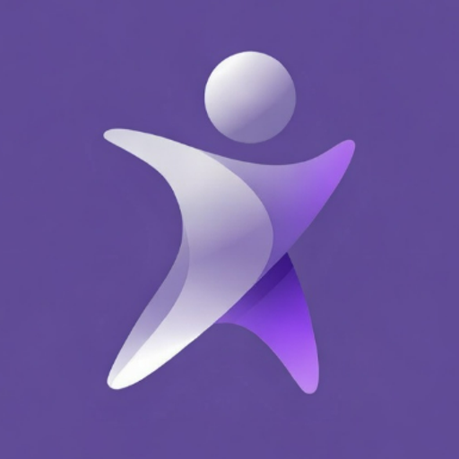
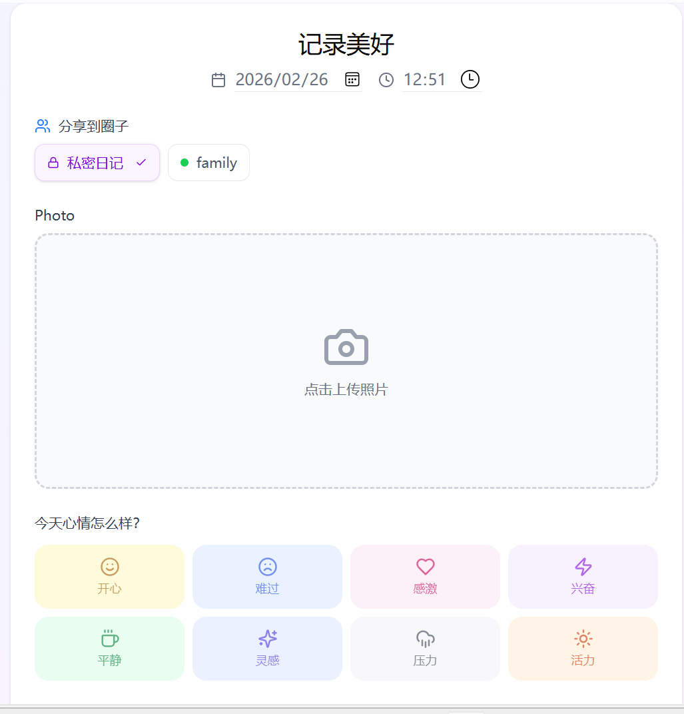
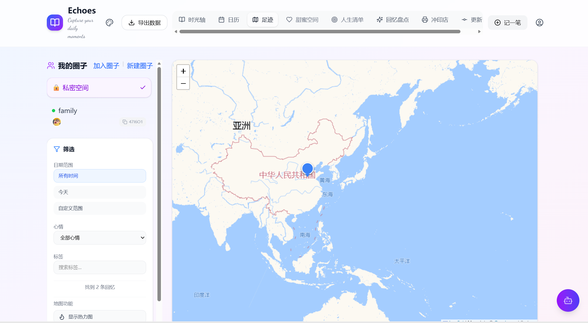
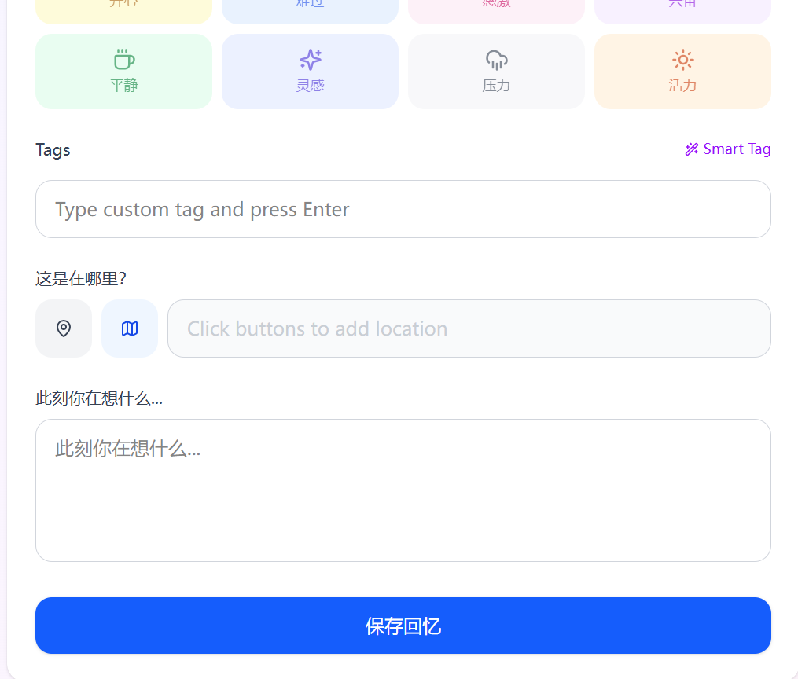
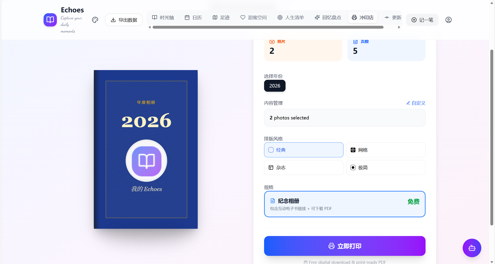

# <div align="center"></div>

# <div align="center">Echoes</div>

<div align="center">
  <strong>记录你的日常点滴 · Capture Your Daily Moments</strong>
</div>

<br />

<div align="center">
  <a href="LICENSE"></a>
  
  
  
  
  
  
</div>

<br />

<div align="center">
  <table>
    <tr>
      <td align="center">
        
        <br />
        <sub><b>日记记录（Diary Entry） </b><br/>记录你的每日生活</sub>
      </td>
      <td align="center">
        
        <br />
        <sub><b>足迹地图 (Footprint Map)</b><br/>展示你的每一步足迹</sub>
      </td>
    </tr>
    <tr>
      <td align="center">
        
        <br />
        <sub><b>日记记录 (Diary Entry)</b><br/>记录你的每日生活</sub>
      </td>
      <td align="center">
        
        <br />
        <sub><b> (PrintShop)</b><br/>将你的日记收录成册</sub>
      </td>
    </tr>
  </table>
</div>

<br />

## 📖 项目简介

**Echoes** 不仅仅是一个照片日记应用，它是你个人记忆的数字保险箱。在这个快节奏的时代，我们希望提供一个静谧的角落，让你能随时停下来，记录下那些稍纵即逝的美好瞬间。

不同于传统的社交媒体，Echoes 坚持 隐私优先 和 真实连接 。这里不仅是你个人的私密花园，更是与挚友、伴侣共享珍贵回忆的温馨角落。通过原生级的移动体验、流畅的动画交互以及智能的多维回顾系统（地图、日历、时间轴），让每一次翻阅都成为一种享受，让每一份分享都充满意义非凡。

## ✨ 核心特性

### 📸 极致的原生体验
利用 Capacitor 8 的强大能力，Echoes 能够直接调用设备的**原生相机**和**相册**。无论是抓拍瞬间还是导入旧照，体验都如原生 App 般丝滑流畅，毫无 Web 应用的割裂感。

### 🤖 AI 智能伴侣
不仅仅是聊天机器人，Echoes 的 AI 深度融入了你的生活：
- **梦境画师 (Dream Painter)**：根据你的日记文字，为你生成独一无二的艺术配图。
- **心情歌单 (Mood Playlist)**：分析你当下的心境，为你推荐最懂你的音乐。
- **每日回顾 (Daily Summary)**：智能总结一天的经历，帮你发现生活中的美好模式。

### ☁️ 离线优先 & 云端同步
Echoes 采用先进的 **Offline-First** 架构。无论在深山还是飞行模式，你都可以毫无阻碍地离线浏览和写作。网络恢复后，所有更改会自动在后台静默同步到 Supabase 云端。

### 🗺️ 点亮你的足迹
**地理标记 (Geotagging)** 功能会自动读取照片的 EXIF 信息（或手动选择位置），并在交互式地图上生成你的专属足迹。看着地图上的光点逐渐铺满世界，是旅行者最大的浪漫。

### 📅 多维度的回忆回顾
- **时光轴 (Timeline)**：以瀑布流的形式，倒序展示你的生活点滴，适合快速浏览。
- **日历视图 (Calendar)**：直观的月视图，哪天写了日记一目了然，方便补记和查找。
- **洞察分析 (Insights)**：(Beta) AI 驱动的情感分析，帮你总结过去一个月的心情变化和高频词汇。

### 🔒 隐私与安全
你的数据完全属于你。我们采用了企业级的 RLS (Row Level Security) 策略，确保只有你自己能访问你的日记。v4.0.0 版本已加入**原生生物识别锁**（FaceID / 指纹）和**后台隐私模糊**功能，为你的隐私再加一把锁。

### ☕ 沉浸式体验
- **视频背景 (Video Backgrounds)**：内置高质量雨窗、森林等动态视频背景，让你在书写时仿佛置身于自然之中。
- **字体自定义 (Font Customization)**：支持霞鹜文楷 (LXGW WenKai)、马善政毛笔体等多款精选中文字体，让文字更有温度。
- **白噪音 (White Noise)**：内置雨声、海浪、森林等自然白噪音，帮助你通过听觉进入心流状态。

### 🎁 赞助
Echoes 是一个开源且免费的项目，但服务器和存储成本需要资金支持。我们接入了 **爱发电 (Afdian)** 赞助系统：
-**如果您觉得Echoes给您带来了忙碌生活中一片宁静的自我空间，为您带来了一丝快乐，可以为我们的团队进行一些打赏赞助。**
-**我们会视情况将您的名字录入到赞助名录里留作纪念。**
-**在此感谢各位的支持！**

### 🌙 沉浸式深色模式
精心调配的深色主题配色，不仅在夜间保护视力，更让照片内容更加突出，营造出专注、静谧的写作氛围。

<br />

## 🛠 技术架构

Echoes 采用现代化的 **React Native Web** 架构思想，结合了 Web 的灵活性和 Native 的性能。

- **前端框架**: React 18 + TypeScript
- **样式方案**: Tailwind CSS + Framer Motion (动画)
- **跨端运行时**: Capacitor 8 (Android & iOS)
- **后端服务**: Supabase (PostgreSQL, Auth, Storage, Edge Functions)
- **构建工具**: Vite
- **状态管理**: Zustand
- **测试框架**: Vitest + React Testing Library

<br />

## 🗺️ 开发路线图 (Roadmap)

- [x] ✅ **基础功能**: 增删改查日记，图片上传，云端同步
- [x] ✅ **多维视图**: 时间轴，日历，地图模式
- [x] ✅ **原生集成**: 相机调用，Haptics 触感反馈
- [x] ✅ **生物识别**: App 启动指纹/面容解锁
- [x] ✅ **沉浸体验**: 动态视频背景、白噪音、多字体支持
- [x] ✅ **赞助系统**: 爱发电 (Afdian) Webhook 自动授权
- [x] ✅ **AI 助手**: 基于 LLM 的日记辅助写作与情感分析
- [x] ✅ **多语言**: 完整的 i18n 国际化支持
- [ ] 📅 **导出功能**: 一键导出 PDF 或 Markdown 格式备份

<br />

## 🚀 快速开始 (Getting Started)

### 环境要求 (Prerequisites)

- **Node.js**: v18 或更高版本
- **包管理器**: npm 或 yarn
- **移动端环境** (可选):
  - Android Studio (用于构建 Android 版本)
  - Xcode (用于构建 iOS 版本，仅限 macOS)

### 安装步骤 (Installation)

1. **克隆仓库**
   ```bash
   git clone https://github.com/xuyang641/Echoes.git
   cd Echoes
   ```

2. **安装依赖**
   ```bash
   npm install
   ```

3. **配置环境变量**
   在项目根目录创建 `.env` 文件，填入你的 Supabase 项目凭证：
   ```env
   VITE_SUPABASE_URL=your_supabase_url
   VITE_SUPABASE_ANON_KEY=your_supabase_anon_key
   
   # Optional: AI Features (Qwen & HuggingFace)
   VITE_QWEN_API_KEY=your_qwen_api_key
   VITE_HF_TOKEN=your_huggingface_token
   
   # Payment & Webhook (Supabase Edge Function)
   # 部署: npx supabase functions deploy afdian-webhook --no-verify-jwt
   # 设置 Secret: npx supabase secrets set AFDIAN_WEBHOOK_SECRET=your_secret
   ```

4. **启动开发服务器**
   ```bash
   npm run dev
   ```
   访问 `http://localhost:5173` 即可预览。

5. **构建移动端应用** (以 Android 为例)
   ```bash
   # 同步代码到原生目录
   npx cap sync
   
   # 启动 Android Studio
   npx cap run android
   ```

## 📱 移动端构建指南

如果你需要生成用于发布的签名 APK 文件，请执行以下命令：

```bash
cd android
./gradlew assembleRelease
```
构建成功后，APK 文件将位于：`android/app/build/outputs/apk/release/app-release.apk`。

<br />

## 📮 联系我们 (Contact Us)

如果你有任何问题、建议，或者发现了 Bug，欢迎随时联系我们！也欢迎加入我们的社区参与讨论。

- **Email**: [2311752562@qq.com](mailto:2311752562@qq.com)
- **GitHub Issues**: [提交反馈](https://github.com/xuyang641/Echoes/issues)

<br />

## 🤝 贡献 (Contributing)

-Echoes 是一个开源项目，我们非常欢迎社区的贡献！无论是修复 Bug、提交新功能，还是改进文档，都是对我们最大的支持。详见 [Contributing Guide](CONTRIBUTING.md)。
-**您的star点亮是对我们工作付出的认可，如果您觉得我们的项目不错，麻烦您点亮star，这是对我们最大的鼓励！**
## 📄 许可证 (License)

本项目采用 **MIT 许可证** 开源 - 详见 [LICENSE](LICENSE) 文件。你可以免费使用、修改和分发此项目，但请保留版权声明。

---

<details>
<summary><strong>🇺🇸 English Version (Click to expand)</strong></summary>

## 📖 Introduction

**Echoes** is more than just a photo diary app; it is a digital safe for your personal memories. In this fast-paced world, we aim to provide a quiet corner where you can pause and capture those fleeting, beautiful moments.

Unlike traditional social media, Echoes prioritizes **privacy** and **self-reflection**. No likes, no comments—just you and your memories. With a native-grade mobile experience, fluid animations, and intelligent review systems (Map, Calendar, Timeline), every revisit becomes a delight.

## ✨ Key Features

### 📸 Native Experience
Leveraging Capacitor 8, Echoes seamlessly integrates with your device's **native camera** and **gallery**. Whether snapping a new photo or importing an old one, the experience is smooth and indistinguishable from a native app.

### ☁️ Seamless Cloud Sync
Powered by **Supabase**, your entries and photos are synchronized to the cloud in milliseconds. Whether you switch phones or use the web version, your memories are always online and safe.

### 🗺️ Map Your Journey
**Geotagging** automatically reads EXIF data from your photos (or allows manual location selection) to plot your footprints on an interactive map. Watching the map light up with your memories is a traveler's romance.

### 📅 Multi-Dimensional Review
- **Timeline**: A cascading, reverse-chronological feed perfect for quick browsing.
- **Calendar**: An intuitive monthly view that shows you at a glance which days have entries.
- **Insights**: (Beta) AI-driven sentiment analysis to summarize your mood trends and frequent topics.

### 🔒 Privacy & Security
Your data belongs to you. We use enterprise-grade RLS (Row Level Security) to ensure only you can access your diary. v4.0.0 now includes **Biometric Lock** (FaceID / Fingerprint) and **Privacy Screen** (blur content in background) for maximum protection.

### 🌙 Immersive Dark Mode
A carefully crafted dark theme that not only protects your eyes at night but also makes your photos pop, creating a focused and serene writing atmosphere.

<br />

## 🛠 Tech Stack

Echoes follows the modern **React Native Web** philosophy, combining the flexibility of the Web with the performance of Native.

- **Frontend**: React 18 + TypeScript
- **Styling**: Tailwind CSS + Framer Motion
- **Runtime**: Capacitor 8 (Android & iOS)
- **Backend**: Supabase (PostgreSQL, Auth, Storage)
- **Build**: Vite
- **State**: Zustand
- **Testing**: Vitest

<br />

## 🚀 Getting Started

### Prerequisites

- **Node.js**: v18+
- **Android Studio** (for Android build)
- **Xcode** (for iOS build, macOS only)

### Installation

1. **Clone the repository**
   ```bash
   git clone https://github.com/xuyang641/Echoes.git
   cd Echoes
   ```

2. **Install dependencies**
   ```bash
   npm install
   ```

3. **Environment Setup**
   Create a `.env` file in the root directory:
   ```env
   VITE_SUPABASE_URL=your_supabase_url
   VITE_SUPABASE_ANON_KEY=your_supabase_anon_key
   ```

4. **Run Web Server**
   ```bash
   npm run dev
   ```

5. **Run on Mobile**
   ```bash
   npx cap sync
   npx cap run android
   ```

</details>

<br />

---
<div align="center">
  Crafted with ❤️ by Echoes Team
</div>
